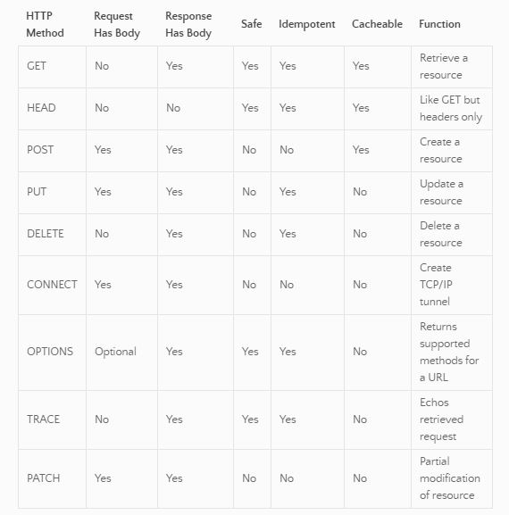
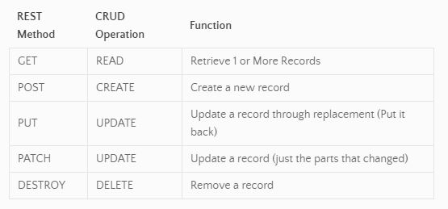
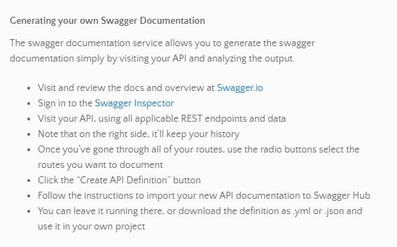

## HTTP and REST

### Reading
#### **HTTP Requests** 
- **H**yper **T**ext **T**ransfer **P**rotocol 
- stateless, request / response protocol. Most commonly transfers .html, .json, .xml
  - **stateless** any communication that happens on API contains all of the info that needs responding to
- request format: *1st line* - METHOD, URL, HTTP VERSION, *following lines* - HEADERS
  - **Headers are separated** by a **newline** character
- **Header** key : value pairs, separated by `;`, terminated by an empty line. Optional - body may follow header
- 
  - **safe methods** should only be used for info retrieval and should not change server state
  - **idempotent methods** if two identical requests are made, they should get identical response
  - **cachable methods** client should be able to cache the response

**Example HTTP Request**
- POST /api/note HTTP/1.1
- Host: api.example.com
- Origin: www.example.com
- Authorization: Bearer - bHVsIHRoaXMgaXMgYSBmYWtlIHNlY3JldCB0b2tlbg==
- Accept: application/json
- Content-Type: application/json; charset=UTF-8
- Content-Length: 58

- {"title":"kata","content":"get 100 points on hacker rank"}

#### **REST**
- **RE**presentative **S**tate **T**ransfer
- *Can reference*, *manipulate*, and *transfer* state
  - **Methods** (*verbs*) to operate on the state of a **Resource** (*noun*)
  - Generally uses HTTP as the transfer protocol
- **RESTful Endpoint** URI that identifies the resource
  - "Performing CRUD operations over HTTP"
- 

**Diagram of REST request**
- `RESTful Endpoint: http://api.server.com/api/v1/people`

`http://` Protocol/Scheme
`api.server.com` Domain or Server
`/api/v1` API Endpoint
`/people` The resource (This identifies a collection: all people)
`/people/12345` A more specific resource: The person with id 12345

#### REST Documentation (*formerly Swagger*)
- The standard for documenting REST APIs is with a “live” documentation system: Open API (formerly “Swagger”)
- 

### Lecture
- **JAM / MEAN / MERN Stack**  all describe the main technologies of a distributed system
  - **MERN** **M**ongo **E**xpress **R**eact **N**ode
  - **MEAN** **M**ongo **E**xpress **A**ngular **N**ode
  - **JAM** **J**avaScript **A**PIs **M**arkup *serverless*

##### Resources
- [http and rest](https://www.youtube.com/watch?v=Q-BpqyOT3a8)
- [http basics](https://code.tutsplus.com/tutorials/http-the-protocol-every-web-developer-must-know-part-1--net-31177)
- [what is ReST](https://restfulapi.net/)
- [swagger documentation](https://swagger.io/docs/)
- [swagger editor](https://editor.swagger.io/)
- [http reference](https://code-maze.com/the-http-reference/) - Method / Description / Has body? chart
- [rest reference](https://www.restapitutorial.com/lessons/httpmethods.html)