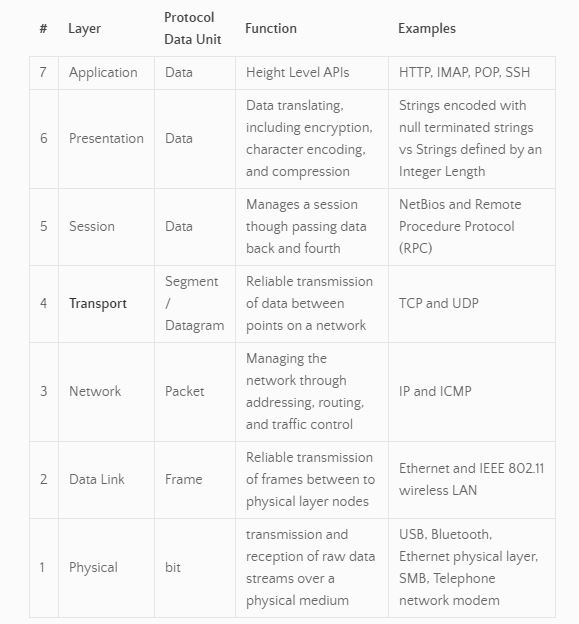
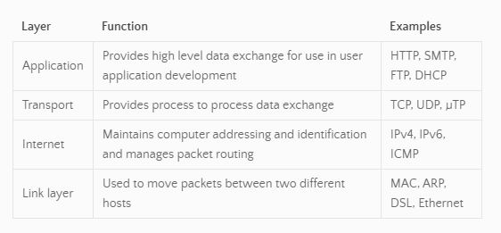
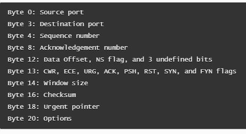

# TCP Servers

Event Queues
- **Services** can **communicate with one another** using various protocols using proprietary APIs. Generally, this is done through a central **“Hub” server** (or *Queue*)
  - **Hub** 
    1. receives all inbound messages
    2. scrubs the content
    3. then broadcasts those messages to connected subscribers

TCP 3-Way Handshake

OSI Model
- **O**pen **S**ystems **I**nterconnection Reference Model: Seven layer model to **describe the different processes in computer networking**
  -  developer responsibilities
    - usually for the goals of a specific layer 
    - communicating with the layer above and below

Seven Layers

Internet Protocol Suite
- **conceptual model** for the **protocols used** by the internet
- ***TCP/IP*** common name, because IP and TCP were the *original protocols in the suite*

TCP 
- **T**ransmission **C**ontrol **P**rotocol
  - creates a **two way communication** between two **hosts**
  - provides reliable, ordered, and error checked **byte streams**
- data flows in **packets**

TCP Header - contains information

### Resources
Videos
- [OSI Model Explained](https://www.youtube.com/watch?v=vv4y_uOneC0)
- [TCP Handshakes Explained](https://www.youtube.com/watch?v=xMtP5ZB3wSk)

Bookmark / Skim
- [OSI Model](https://www.cloudflare.com/learning/ddos/glossary/open-systems-interconnection-model-osi/)
- [What is TCP](https://searchnetworking.techtarget.com/definition/TCP)
- [Build a TCP Server (code only)](https://techbrij.com/node-js-tcp-server-client-promisify)
- [Node docs: net module](https://nodejs.org/api/net.html)