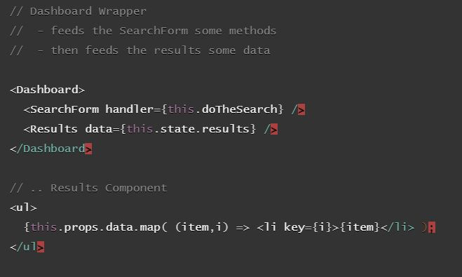
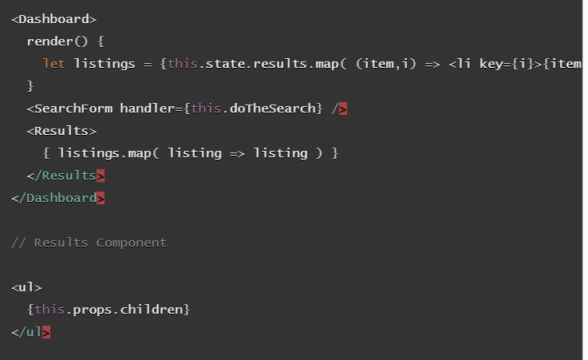

# Component Composition

**Routing**
- Using **react-router**, easily toggle the visibility of components (or even pages) based on the URL/Route that the user engages with.
- `import { Route } from 'react-router-dom';`

**To use Browser Router:**
  - eliminate use of `<a>` tags and instead use it’s built-in `<Link>` component.

- `<Route exact path="/" component={Home} />`
- `<Route exact path="/stuff" render={() => <List>{items}</List>} />`

**Component Composition - Logical**
- *send raw data* to *child components* and allow them to *render* the output *as they decide*.

**Component Composition - Using Logic-less Children**
- typically used when *children* are already in JSX form (pre-rendered) and you *need to display* them *as a whole*. 
  - example: gallery of images
  

### Resources
- [react basics recap](https://medium.freecodecamp.org/these-are-the-concepts-you-should-know-in-react-js-after-you-learn-the-basics-ee1d2f4b8030)
- [props.children](https://codeburst.io/a-quick-intro-to-reacts-props-children-cb3d2fce4891)
- [browser router tutorial](https://blog.pshrmn.com/entry/simple-react-router-v4-tutorial/)
- [composition vs inheritance](https://reactjs.org/docs/composition-vs-inheritance.html)
- [browser router api docs](https://reacttraining.com/react-router/web/api)