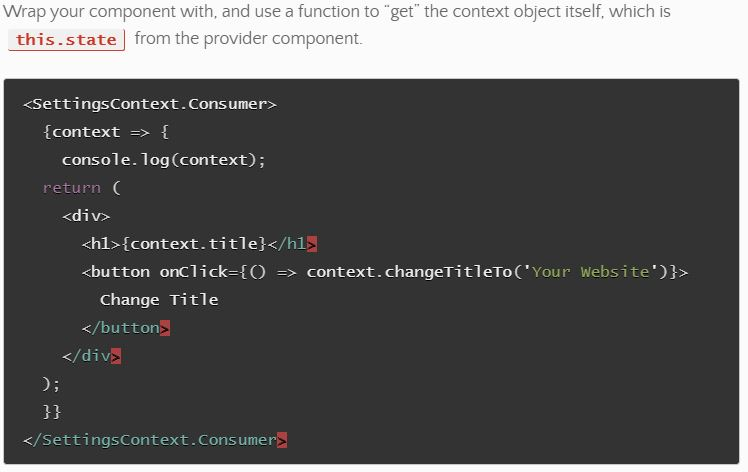
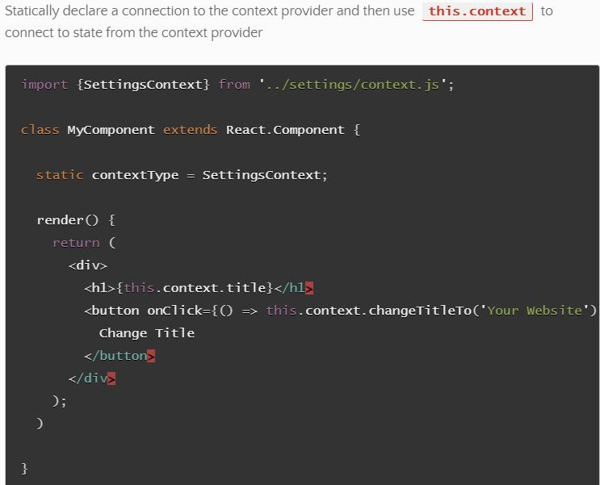
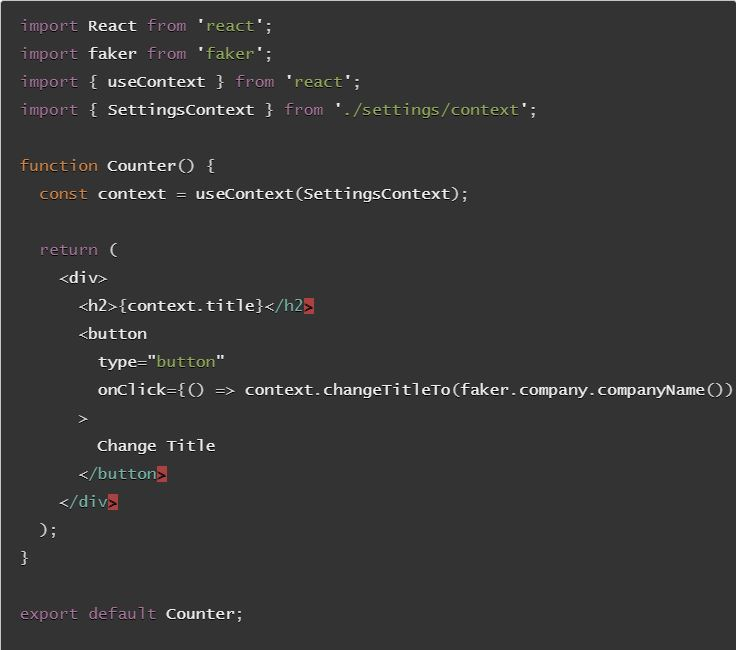

# Context API

## Context
- Provides a **means of passing state down** the component tree through a *Provide/Consumer* relationship
- a **“provider”** can **make it’s state available**, along with **means of altering it** (*methods*).
- At the lower levels, any *component* can *“opt-in”* and become a **“consumer”** and **receive this.state** from context.

How to connect with Classes
- 
- 

How to connect with Functional
- use the **`useContext()`** hook to tap in
- Returns and provides access to whatever your context provider exports
- 

### Resources
- [context api](https://reactjs.org/docs/context.html)
- [hooks and context example](https://medium.com/swlh/snackbars-in-react-an-exercise-in-hooks-and-context-299b43fd2a2b)
- [react context links](https://github.com/diegohaz/awesome-react-context)