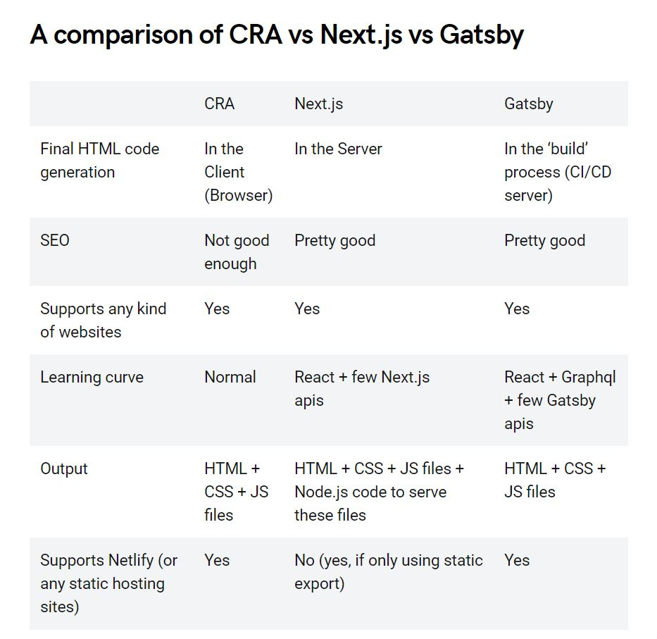

# Gatsby, next.js, and other JS Frameworks

# Reading
- [CRA vs Gatsby vs Next](https://coffeencoding.com/cra-vs-next-js-vs-gatsby/)

They both:
  - Generate very performant websites.
  - Creates SPA out-of-the-box.
  - Creates good SEO out-of-the-box
  - Have an awesome developer experience.
  - both can call APIs client side
  - Also, neither of them are boilerplates but toolkits
- they are at the same time *fundamentally different*

Gatsby
- Gatsby is a **static** site generator tool.
- Gatsby **can function without any server** at all.
- generates pure HTML/CSS/JS.
- extremely scalable

Next.js
- Next **requires a server** to be able to run.
- creates HTML on runtime 

[Gatsby vs Next](https://blog.jakoblind.no/gatsby-vs-next/)

[top 10 javascript frameworks](https://geekflare.com/best-javascript-frameworks/)
- 2020
- Provides VISUALS for how each framework works! Yay!

[top 10 php frameworks](https://stackify.com/php-frameworks-development/)
- 2018
- 

### Resources
Gatsby and next.js resources
- [Learn Next.js](https://nextjs.org/learn/basics/getting-started)
- [Gatsby Tutorial](https://www.gatsbyjs.org/tutorial/)
- [Next.js Docs](https://nextjs.org/docs)
- [Gatsby.js Docs](https://www.gatsbyjs.org/docs/)

Other Frameworks
- [AngularJS](https://angularjs.org/)
- [Angular](https://angular.io/)
- [vue](https://vuejs.org/)

- [backbone](http://backbonejs.org/)
- [ember](https://www.emberjs.com/)
- [knockout](https://knockoutjs.com/)
- [Laravel (php)](https://laravel.com/)